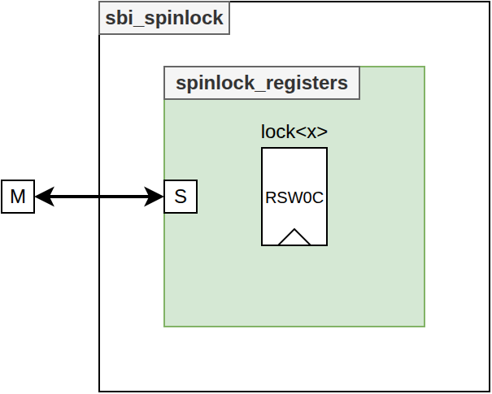

<!--
  README GENERATION INSTRUCTIONS (for the next regeneration run)
  ----------------------------------------------------------------
  This README follows the common Asylum IP model. Regenerate it from the
  sources, never from the previous README text alone.

  Sources of truth (in priority order):
    1. hdl/*.vhd            : entities, generics, ports, packages
    2. hdl/csr/*.hjson      : register map (regtool); *_csr.md/.h are generated
    3. <IP>.core            : VLNV (name), filesets, targets, depends, revisions
    4. mk/targets.txt       : target list shown by `make help`; mk/defs.mk
    5. sim/, syn/, esw/, boards/ : testbenches, constraints, software
  Section order (keep it, same headings in every IP):
    CI badge / Title + one-line description + VLNV / Table of Contents /
    Introduction (Key Features) / Block Diagram / Top-Level (Parameters,
    Ports, Instantiation Example) / HDL Modules / Register Map /
    Verification / Synthesis / Design Notes (optional) /
    Directory Structure / Dependencies
  Rules:
    - Language: English. Tables: Parameters = Name|Type|Default|Description,
      Ports = Name|Direction|Type|Description (grouped by interface).
    - Register Map: link to the generated hdl/csr/<X>_csr.md (plus the
      .hjson source and _csr.h header); never copy register tables here.
    - Top-Level = sbi_* wrapper if present, else the entity used by the
      `default` target, else the main entity (libraries: list packages).
    - Write "This IP has no software-visible registers." / "No dedicated
      synthesis target ..." instead of removing a section.
    - Keep still-accurate hand-written content (ISA tables, results,
      images) in "Design Notes"; drop anything not backed by the sources.
    - Block diagram: doc/<NAME>.drawio (NAME = 4th field of the VLNV),
      top entity box with generics on top, inputs left, outputs right,
      bus interfaces as bold arrows, internal blocks colour-coded
      (CSR yellow, FIFO/memory green, core logic blue, external grey).
      Update it whenever ports/generics/sub-blocks change.
    - Do not edit generated files (hdl/csr/*_csr.*) or the CI badge URL.
-->
[](https://github.com/deuskane/asylum-system-spinlock/actions/workflows/ci.yml)

# asylum-system-spinlock

**Two hardware spinlocks (read-to-set / write-0-to-clear registers) with CSR access over the SBI bus.**

VLNV: `asylum:system:spinlock:1.0.2`

## Table of Contents

1. [Introduction](#introduction)
2. [Block Diagram](#block-diagram)
3. [Top-Level](#top-level)
4. [HDL Modules](#hdl-modules)
5. [Register Map](#register-map)
6. [Verification](#verification)
7. [Synthesis](#synthesis)
8. [Design Notes](#design-notes)
9. [Directory Structure](#directory-structure)
10. [Dependencies](#dependencies)

## Introduction

This IP provides two hardware locks, `lock0` and `lock1`, for software agents sharing an SBI interconnect. Each lock is an 8-bit regtool register with the `rsw0c` software access model: a read returns the current value and atomically sets all bits, a write of 0 clears them. Reading `0x00` therefore means the lock was free and is now owned by the reader (test-and-set in a single bus access); writing `0x00` releases it. The IP has no hardware-side function: it is purely a CSR bank. It is instantiated as an SBI target in `asylum-soc-picosoc` (`PicoSoC_user.vhd`).

### Key Features

- 2 independent locks: `lock0` at address `0x0`, `lock1` at address `0x1`
- Atomic acquire: one SBI read both tests and sets the lock (`rsw0c` model of `csr_reg`)
- Release by writing `0x00`; both locks are free after reset (init `0x00`)
- Never stalls the bus (`sbi_tgt_o.ready` always high)
- Instance name (`NAME`) reported in `sbi_tgt_o.info.name` (default `"spinlock"`)
- CSR bank generated by regtool from [hdl/csr/spinlock.hjson](hdl/csr/spinlock.hjson)

## Block Diagram




- The SBI bus accesses `spinlock_registers` (generated by regtool from [hdl/csr/spinlock.hjson](hdl/csr/spinlock.hjson)).
- `lock0` and `lock1` are two `csr_reg` instances with `MODEL => "rsw0c"`, `WIDTH => 8`, `INIT => x"00"`.
- `hwaccess` is `none`: no hardware write path; the only CSR outputs are the read / write strobes (`sw2hw.lockN.re`, `sw2hw.lockN.we`), left unconnected in `sbi_spinlock`.

## Top-Level

Top-level entity: **`sbi_spinlock`** ([hdl/sbi_spinlock.vhd](hdl/sbi_spinlock.vhd)), library `asylum`, component declared in `asylum.spinlock_pkg`.

### Parameters

| Name | Type | Default | Description |
|------|------|---------|-------------|
| `NAME` | string | `""` | Instance name, forwarded to the CSR block (`MODULE_NAME`, visible in `sbi_tgt_o.info.name`; `"spinlock"` when empty) |

### Ports

#### Clock & Reset

| Name | Direction | Type | Description |
|------|-----------|------|-------------|
| `clk_i` | in | std_logic | System clock |
| `arst_b_i` | in | std_logic | Asynchronous reset, active low (releases both locks) |

#### Bus (SBI)

| Name | Direction | Type | Description |
|------|-----------|------|-------------|
| `sbi_ini_i` | in | sbi_ini_t | SBI request from the initiator (`cs`, `re`, `we`, `addr`, `wdata`) |
| `sbi_tgt_o` | out | sbi_tgt_t | SBI response to the initiator (`ready`, `rdata`, `info`) |

### Instantiation Example

```vhdl
library asylum;
use     asylum.sbi_pkg.all;
use     asylum.spinlock_pkg.all;

  ins_spinlock : entity asylum.sbi_spinlock
    generic map
    ( NAME      => "SPINLOCK0"
    )
    port map
    ( clk_i     => clk
     ,arst_b_i  => arst_b
     ,sbi_ini_i => sbi_inis(SPINLOCK_ID)  -- sbi_ini_t(addr(0 downto 0), wdata(7 downto 0))
     ,sbi_tgt_o => sbi_tgts(SPINLOCK_ID)  -- sbi_tgt_t(rdata(7 downto 0))
    );
```

The CSR bank uses 1 address bit (`SPINLOCK_ADDR_WIDTH = 1`) and 8-bit data (`SPINLOCK_DATA_WIDTH = 8`), see `asylum.spinlock_csr_pkg`.

## HDL Modules

| File | Unit | Kind | Role |
|------|------|------|------|
| [hdl/spinlock_pkg.vhd](hdl/spinlock_pkg.vhd) | `spinlock_pkg` | package | Component declaration of `sbi_spinlock` |
| [hdl/sbi_spinlock.vhd](hdl/sbi_spinlock.vhd) | `sbi_spinlock` | entity | Top-level: instantiates the CSR bank only |
| hdl/csr/spinlock_csr.vhd | `spinlock_registers` | entity | Generated CSR bank (regtool), two `csr_reg` (`rsw0c`) instances |
| hdl/csr/spinlock_csr_pkg.vhd | `spinlock_csr_pkg` | package | Generated types (`spinlock_sw2hw_t`), addresses (`SPINLOCK_LOCK0`, `SPINLOCK_LOCK1`), widths and component `spinlock_registers` |

### spinlock_registers

Generated by regtool; documented here because `sbi_spinlock` is only a wrapper around it.

#### Parameters

| Name | Type | Default | Description |
|------|------|---------|-------------|
| `MODULE_NAME` | string | `""` | Name returned in `sbi_tgt_o.info.name` (`"spinlock"` when empty) |

#### Ports

| Name | Direction | Type | Description |
|------|-----------|------|-------------|
| `clk_i` | in | std_logic | System clock |
| `arst_b_i` | in | std_logic | Asynchronous reset, active low |
| `sbi_ini_i` | in | sbi_ini_t | SBI request |
| `sbi_tgt_o` | out | sbi_tgt_t | SBI response |
| `sw2hw_o` | out | spinlock_sw2hw_t | Per lock: `re` / `we` strobes, registered one cycle after the software access (unused by `sbi_spinlock`) |

There is no `hw2sw_i` port: no register has a hardware write access, so regtool generates no `spinlock_hw2sw_t` record.

## Register Map

The register map is generated by regtool from [hdl/csr/spinlock.hjson](hdl/csr/spinlock.hjson):

- Register documentation: **[hdl/csr/spinlock_csr.md](hdl/csr/spinlock_csr.md)**
- C header: [hdl/csr/spinlock_csr.h](hdl/csr/spinlock_csr.h)

Notes:

- Both registers use `swaccess: rsw0c` (read sets, write 0 clears) and `hwaccess: none`.
- A read returns `0x00` when the lock was free (the reader now owns it) and `0xFF` when it was already taken (all 8 bits are set by `rsw0c`); software must test for zero / non-zero, as `spinlock_try_lock()` of `asylum-soc-picosoc/esw` does.

## Verification

### Testbenches

| File | DUT | Description |
|------|-----|-------------|
| [sim/tb_spinlock.vhd](sim/tb_spinlock.vhd) | `sbi_spinlock` | UVVM testbench with the SBI VIP; every access is checked to complete without wait state (`max_wait_cycles = 0`). T1 reset value (first read `0x00`, second `0xFF`) on each lock, T2 test-and-set / release three times per lock (`0x00`, `0xFF`, `0xFF`, write `0x00`), T3 independence of `lock0` / `lock1`, T4 other write values (`0xFF` / `0xA5` keep a free lock free, `0xFF` keeps a taken lock taken, `0x0F` on a taken lock reads back `0x0F` then `0xFF`, `0xF0` then `0x0F` frees it), T5 asynchronous reset releases both locks. 43 checks |

### Targets

| Target | Toplevel | Description |
|--------|----------|-------------|
| `default` | `sbi_spinlock` | HDL fileset + CSR generation (not a simulation) |
| `sim_spinlock` | `tb_spinlock` | Simulation of `sbi_spinlock` with VIP |

### How to Run

The default tool is GHDL (`mk/defs.mk`: `TOOL ?= ghdl`, `TARGET ?= sim_spinlock`).

```bash
make help                    # variables, rules and target list (mk/targets.txt)
make sim_spinlock            # run the testbench (log in log/)
make nonreg_sim              # run every sim_* target
make clean                   # remove build/ and log/
```

Equivalent FuseSoC command:

```bash
fusesoc --cores-root . run --build-root build --target sim_spinlock asylum:system:spinlock:1.0.2
```

CI ([.github/workflows/ci.yml](.github/workflows/ci.yml)) runs the `sim_spinlock` target.

## Synthesis

No dedicated synthesis target. The HDL sources of the `default` target (`hdl/*.vhd` + generated CSR) contain no simulation-only code (no file I/O, no `translate_off` section) and are synthesizable. The design is two 8-bit registers plus the address decoding (each `csr_reg` also registers its read / write strobes).

## Design Notes

### rsw0c Behaviour (csr_reg)

Next value of a lock register, from `csr_reg` with `MODEL = "rsw0c"` and no hardware write:

| Software access | Read data | Next value |
|-----------------|-----------|------------|
| Read | current value | `0xFF` |
| Write `wdata` | - | current value AND `wdata` (`0x00` releases) |
| None | - | unchanged |

### Software Usage

```c
#include "spinlock_csr.h"

volatile uint8_t *spinlock = (uint8_t *)SPINLOCK_BASE;    // SPINLOCK_BASE: system address map

while (spinlock[SPINLOCK_LOCK0] != 0) ;                   // acquire: read 0x00 = lock obtained
/* critical section */
spinlock[SPINLOCK_LOCK0] = 0x00;                          // release
```

A read by an agent that does not own the lock leaves it taken (`0xFF` stays `0xFF`), so polling is safe. Only the owner should write `0x00`.

## Directory Structure

```
asylum-system-spinlock/
├── spinlock.core                # FuseSoC core (asylum:system:spinlock)
├── Makefile                     # Common Asylum Makefile (FuseSoC wrapper)
├── mk/
│   ├── defs.mk                  # FILE_CORE, default TARGET and TOOL
│   └── targets.txt              # Target list (generated from the .core)
├── doc/
│   └── spinlock.drawio          # Block diagram
├── sim/
│   └── tb_spinlock.vhd          # UVVM testbench
├── hdl/
│   ├── spinlock_pkg.vhd
│   ├── sbi_spinlock.vhd
│   └── csr/
│       ├── spinlock.hjson       # Register description (source)
│       ├── spinlock_csr.vhd     # Generated
│       ├── spinlock_csr_pkg.vhd # Generated
│       ├── spinlock_csr.md      # Generated
│       └── spinlock_csr.h       # Generated
└── .github/workflows/ci.yml     # CI (one job per sim_* target, generated by make ci_generate)
```

## Dependencies

| Core | Used by (fileset) | Purpose |
|------|-------------------|---------|
| `asylum:utils:generators` | `hdl` | regtool generator and CSR building blocks (`csr_reg`) |
| `asylum:utils:pkg` | `hdl` | Common packages (`sbi_pkg`, `logic_pkg`) |
| `asylum:target:techmap` | `hdl` | `techmap_pkg` (referenced by a `use` clause in `sbi_spinlock.vhd`; no cell is instantiated) |
| `bitvis:verification:uvvm` | `sim` | UVVM utility library and SBI VIP (`bitvis_vip_sbi`) |
